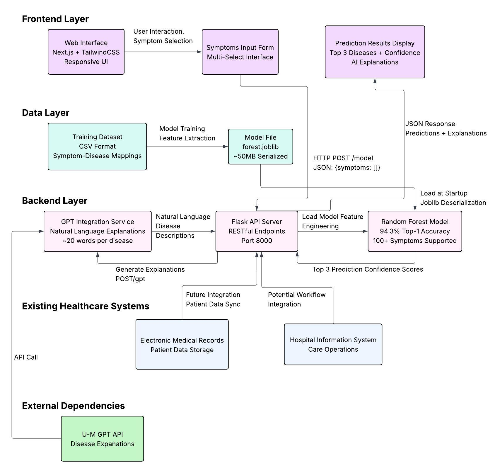
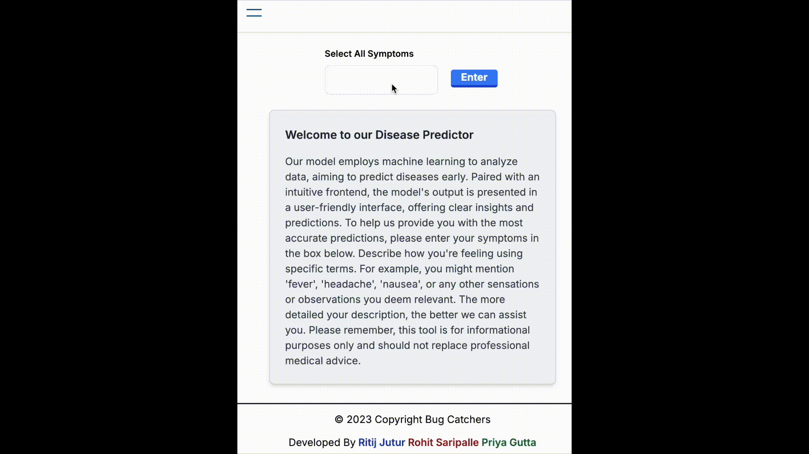
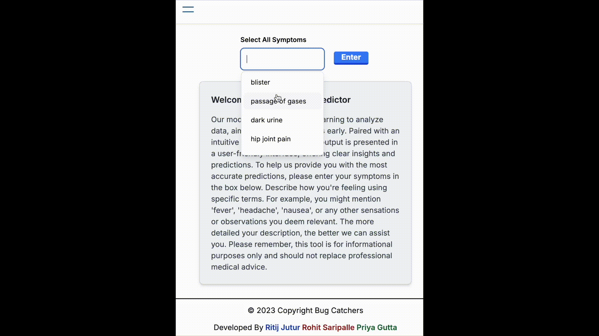
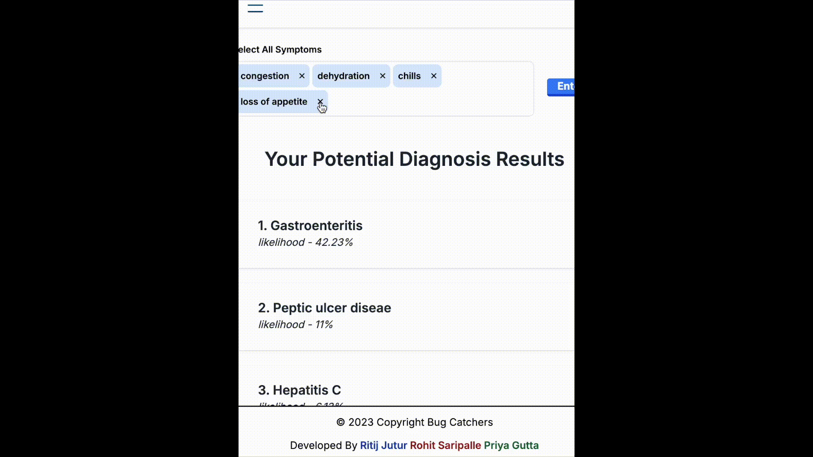

# 🏥 DiseasePredictor

<p align="center">
  <em>A machine learning project for using symptoms to predict diseases</em>
</p>

<p align="center">
  
  
  
  
  
  
</p>

## 🎯 About This Project

**DiseasePredictor** is a machine learning web application that predicts diseases based on symptom input. The team developed this at a hackathon to explore how AI can be applied to healthcare data analysis. The project combines a trained Random Forest model with a modern web interface to provide intuitive disease prediction capabilities.

### Key Features

- **🔮 Disease Prediction** - Input symptoms to receive the top 3 most likely disease predictions
- **📊 Confidence Scoring** - View confidence percentages for each prediction
- **🤖 AI Explanations** - Get natural language explanations for predicted diseases using GPT integration
- **🌐 Modern Interface** - Clean, responsive web interface built with Next.js and TailwindCSS
- **⚡ Real-time Processing** - Instant predictions with fast API responses

### Target Audience

- **Students and researchers** studying machine learning applications in healthcare
- **Developers** interested in medical AI implementations
- **Educators** looking for examples of ML in healthcare contexts

### Important Disclaimer

This is an **educational project only** and should not be used for medical diagnosis or treatment decisions. Always consult qualified healthcare professionals for medical advice.

---

## 📋 Table of Contents

- [🎯 About This Project](#-about-this-project)
- [🏗️ Architecture Overview](#️-architecture-overview)
- [🚀 Getting Started](#-getting-started)
  - [Prerequisites](#prerequisites)
  - [Backend Setup (Flask API)](#backend-setup-flask-api)
  - [Frontend (Next.js) Setup](#frontend-nextjs-setup)
- [✨ Features](#-features)
- [🔌 API Documentation](#-api-documentation)
  - [POST /model](#post-model)
  - [POST /gpt](#post-gpt)
- [💡 Usage Examples](#-usage-examples)
- [❓ Frequently Asked Questions](#-frequently-asked-questions)
- [🛠️ Future Development Plans](#️-future-development-plans)
- [📚 Additional Resources](#-additional-resources)

---

## 🏗️ Architecture Overview

The project is structured with a clear separation between the frontend interface and backend processing. Here's how the components work together:



### Technology Stack

| Component          | Technology   | Purpose                                                    |
| ------------------ | ------------ | ---------------------------------------------------------- |
| **Frontend**       | Next.js      | Modern React framework with server-side rendering          |
| **Styling**        | TailwindCSS  | Utility-first CSS framework for rapid development          |
| **Backend**        | Flask        | Lightweight Python web framework for API development       |
| **ML Model**       | scikit-learn | Machine learning library with Random Forest implementation |
| **AI Integration** | U-M GPT API  | University-provided API for natural language explanations  |

## 🚀 Getting Started

This guide will help you set up and run the DiseasePredictor application on your local machine. The setup process involves configuring both the backend API and frontend interface.

### Prerequisites

Before starting, ensure you have the following software installed:

| Requirement | Version | Download                         |
| ----------- | ------- | -------------------------------- |
| **Node.js** | v18+    | [Download](https://nodejs.org/)  |
| **Python**  | 3.10+   | [Download](https://python.org/)  |
| **Git**     | Latest  | [Download](https://git-scm.com/) |

> **Note:** The GPT API integration is optional but recommended for the full experience with AI-generated explanations.

### Backend Setup (Flask API)

1. **Clone and navigate to the repository**

   ```bash
   git clone https://github.com/masterspin/DiseasePredictor.git
   cd DiseasePredictor
   ```

2. **Set up Python virtual environment**

   ```bash
   cd flask
   python -m venv .venv

   # Activate virtual environment
   # macOS/Linux:
   source .venv/bin/activate
   # Windows PowerShell:
   # .venv\Scripts\Activate.ps1
   ```

3. **Install Python dependencies**

   ```bash
   pip install -r requirements.txt
   ```

4. **Configure environment variables**
   Create a `.env` file in the `/flask` directory with the following variables:

   ```env
   UM_GPT_API_KEY=your_api_key_here
   UM_GPT_API_BASE=https://api.umgpt.umich.edu/azure-openai-api/ptu
   UM_GPT_API_VERSION=2023-03-15-preview
   MODEL_PATH=./forest.joblib
   ```

5. **Start the Flask server**
   ```bash
   python app.py
   ```
   The API server will be available at `http://localhost:8080`.

### Frontend (Next.js) Setup

1. **Install frontend dependencies**

   ```bash
   # From the repository root
   npm install
   # or: pnpm install
   ```

2. **Configure frontend environment**
   Create a `.env.local` file in the repository root:

   ```env
   NEXT_PUBLIC_API_BASE_URL=http://localhost:8080
   ```

3. **Start the development server**

   ```bash
   npm run dev
   # or: pnpm dev
   ```

4. **Open your browser**
   Navigate to `http://localhost:3000` to see the application!

## ✨ Features

DiseasePredictor offers a comprehensive suite of features designed for accurate disease prediction and user-friendly interaction:

### Core Prediction Features

- **Top-3 Disease Predictions** with confidence percentages
- **Real-time Analysis** using Random Forest Classifier
- **High Accuracy** (~94.3% Top-1, ~100% Top-3 on test data)
- **Comprehensive Symptom Support** (100+ symptoms supported)
- **GPT-Powered Explanations**  of ~20 words for each predicted disease


_Feature demonstration showing the prediction interface in action_

### User Interface

- **Modern Web Interface** built with Next.js and TailwindCSS
- **Responsive Design** works on desktop, tablet, and mobile
- **Intuitive Symptom Entry** with autocomplete suggestions
- **Clean Results Display** with confidence indicators


_Feature demonstration showing how many symptoms you can select from_


_Feature demonstration showing how to change the input symptoms to update results_

## 🔌 API Documentation

DiseasePredictor provides a RESTful API for disease prediction and AI-powered explanations.

### `POST /model`

Returns top-3 predicted diseases with confidence percentages and optional GPT explanations.

**Request**

```http
POST /model
Content-Type: application/json

{
  "feature_matrix": ["placeholder", "fever", "cough", "fatigue", "headache"]
}
```

**Response**

```json
{
  "message": {
    "0": "Influenza",
    "1": "Common_Cold",
    "2": "COVID-19"
  },
  "responses": [
    "Influenza is a viral respiratory illness causing fever, cough, and body aches.",
    "The common cold is a mild viral infection affecting the upper respiratory tract.",
    "COVID-19 is a respiratory illness caused by the SARS-CoV-2 virus."
  ],
  "percentages": {
    "0": 62.15,
    "1": 21.03,
    "2": 9.44
  }
}
```

### `POST /gpt`

Generate AI-powered explanations for diseases using U-M GPT API.

**Request**

```http
POST /gpt
Content-Type: application/json

{
  "diseases": ["Influenza", "Common_Cold", "COVID-19"]
}
```

**Response**

```json
{
  "explanations": [
    "Influenza is a viral respiratory illness causing fever, cough, and body aches.",
    "The common cold is a mild viral infection affecting the upper respiratory tract.",
    "COVID-19 is a respiratory illness caused by the SARS-CoV-2 virus."
  ]
}
```

---

## 💡 Usage Examples

These examples show how developers can interact with the DiseasePredictor API from different environments (frontend JavaScript, Python, and cURL).

### Basic Prediction Example

```javascript
// Frontend usage with fetch API
const predictDisease = async (symptoms) => {
  try {
    const response = await fetch("http://localhost:8080/model", {
      method: "POST",
      headers: {
        "Content-Type": "application/json",
      },
      body: JSON.stringify({
        feature_matrix: ["placeholder", ...symptoms],
      }),
    });

    const data = await response.json();
    return data;
  } catch (error) {
    console.error("Prediction failed:", error);
  }
};

// Usage
const symptoms = ["fever", "cough", "fatigue"];
const predictions = await predictDisease(symptoms);
console.log(predictions);
```

### Python Client Example

```python
import requests
import json

def predict_disease(symptoms):
    url = "http://localhost:8080/model"
    payload = {
        "feature_matrix": ["placeholder"] + symptoms
    }

    response = requests.post(url, json=payload)
    return response.json()

# Usage
symptoms = ["fever", "cough", "fatigue"]
predictions = predict_disease(symptoms)
print(f"Top prediction: {predictions['message']['0']}")
print(f"Confidence: {predictions['percentages']['0']:.2f}%")
```

### cURL Example

```bash
curl -X POST http://localhost:8080/model \
  -H "Content-Type: application/json" \
  -d '{
    "feature_matrix": ["chills", "fever", "cough", "fatigue"]
  }'
```

## ❓ Frequently Asked Questions

### Medical & Safety

**Q: Is this a medical tool?**  
A: No, this is an educational project only. It should never be used for medical diagnosis, treatment, or any clinical decisions. Always consult qualified healthcare professionals for medical advice.

**Q: Can I use this for self-diagnosis?**  
A: Absolutely not. This tool is for learning purposes only. If you have health concerns, please see a licensed healthcare provider.

**Q: How accurate is the model?**  
A: Based on testing, the model achieves ~94.3% accuracy for top-1 predictions and ~100% accuracy for top-3 predictions on test data. However, these results are from a limited dataset and should not be considered medical-grade accuracy.

### Technical Questions

**Q: What symptoms are supported?**  
A: The model supports 100+ symptoms. Input should match the model's feature names (lowercased, with spaces converted to underscores). Unknown features are automatically ignored.

**Q: How are API keys and secrets handled?**  
A: All sensitive information is stored in `.env` files and accessed via `os.getenv()`. Never commit API keys to version control. Rotate any keys that may have been accidentally exposed.

**Q: What if the GPT API is unavailable?**  
A: The application will gracefully fall back to predictions without AI explanations. Core functionality remains available.

### Setup & Usage

**Q: Can I run this without the GPT integration?**  
A: Yes! The core prediction functionality works without GPT. Simply omit the GPT API configuration in your `.env` file.

**Q: What's the minimum system requirements?**  
A: Node.js 18+, Python 3.10+, and at least 2GB RAM. The model file is approximately 50MB.

**Q: How do I add new symptoms or diseases?**  
A: Currently, this requires retraining the model with new data. Future versions will include tools for easier model updates.

**Q: Can I deploy this to production?**  
A: This is designed as an educational project. For production use, you would need additional security, monitoring, and compliance measures.

### Troubleshooting

**Q: The Flask server won't start**  
A: Check that Python 3.10+ is installed, the virtual environment is activated, and all dependencies are installed. Ensure port 8080 is available.

**Q: The frontend can't connect to the backend**  
A: Verify that `NEXT_PUBLIC_API_BASE_URL` in `.env.local` matches your Flask server URL and that the Flask server is running.

**Q: Predictions seem inaccurate**  
A: Remember this is an educational demo. The model was trained on limited data and may not reflect real-world medical accuracy.

**Q: How can I contribute to this project?**  
A: See the [Contributing](#-contributing) section below. We welcome bug reports, feature requests, and code contributions!

## 🛠️ Future Development Plans

We will collect user data with consent to train our model on more diseases and symptoms to increase our accuracy and repertoire. We plan to add a feature where users can upload their data to our firebase storage. Overall, we want people to have access to quick preliminary insights at the click of a button to improve overall public health.

## 📚 Additional Resources

### Dataset Information

- **Supported Diseases**: [View complete list](https://github.com/masterspin/DiseasePredictor/blob/main/src/diseases.txt)
- **Supported Symptoms**: [View complete list](https://github.com/masterspin/DiseasePredictor/blob/main/src/symptoms.txt)

---

<div align="center">
  <p><strong>⚠️ Medical Disclaimer</strong></p>
  <p><em>This is an educational project only. Not for medical diagnosis or treatment.</em></p>
  <p><em>Always consult qualified healthcare professionals for medical advice.</em></p>
</div>

---

<div align="center">
  <p>
    <a href="#-about-this-project">Back to Top</a> •
    <a href="#-getting-started">Getting Started</a> •
    <a href="#-api-documentation">API Docs</a>
  </p>
</div>

---
